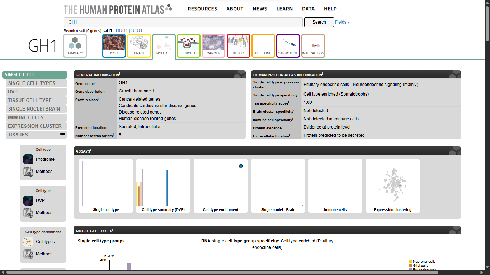
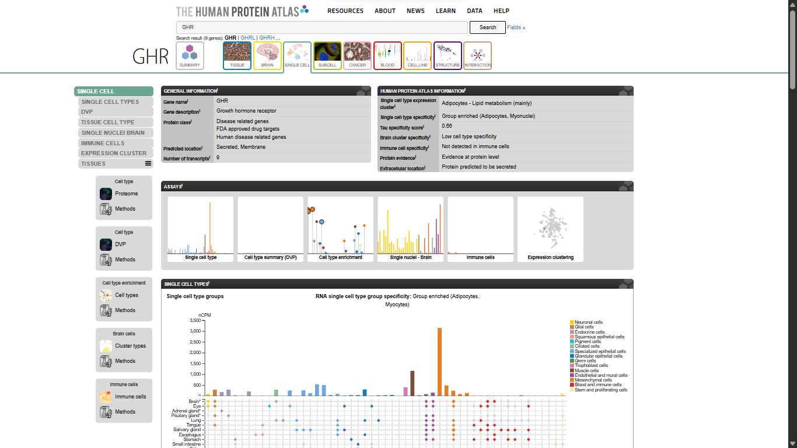
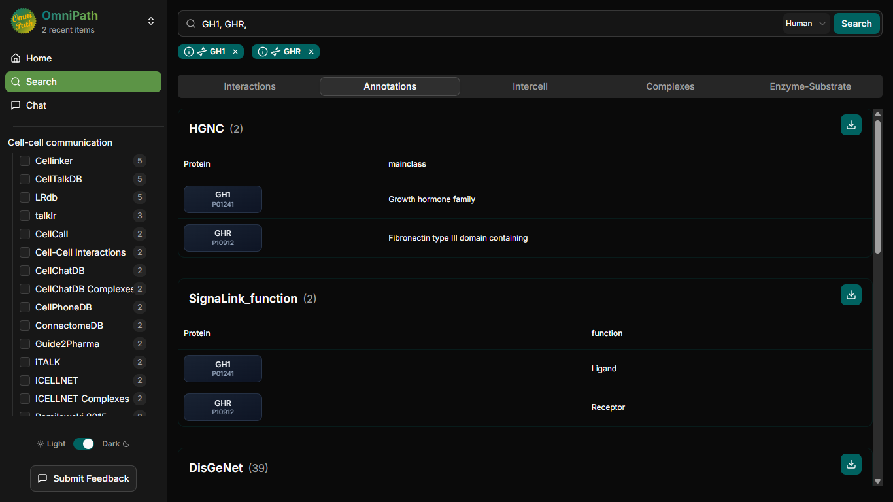
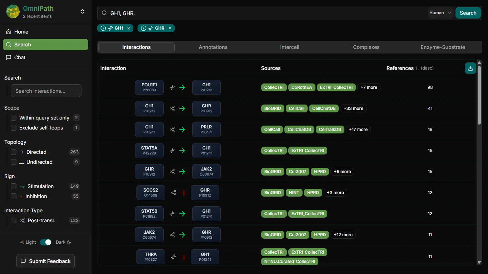
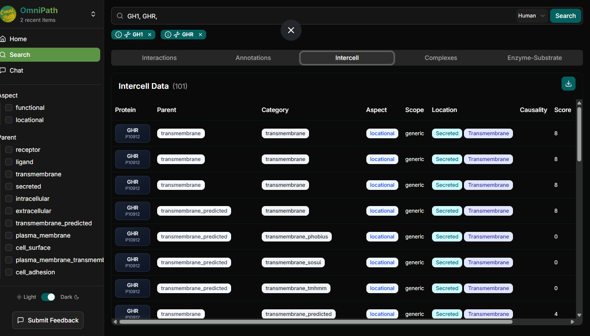
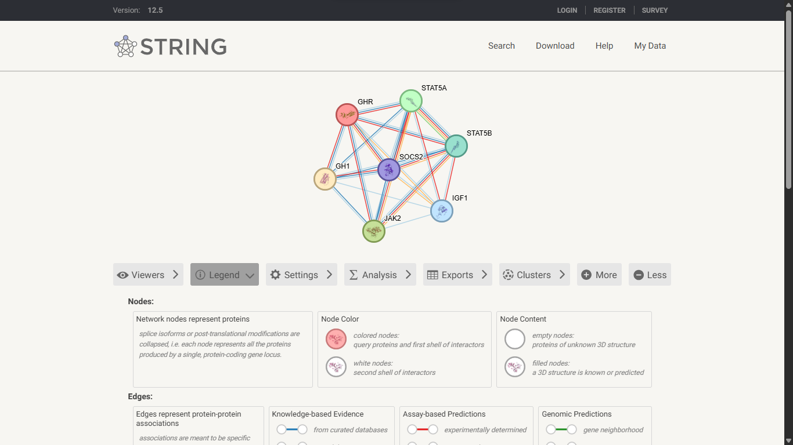
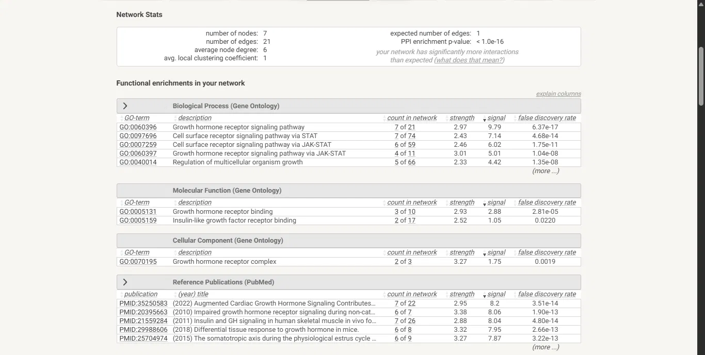
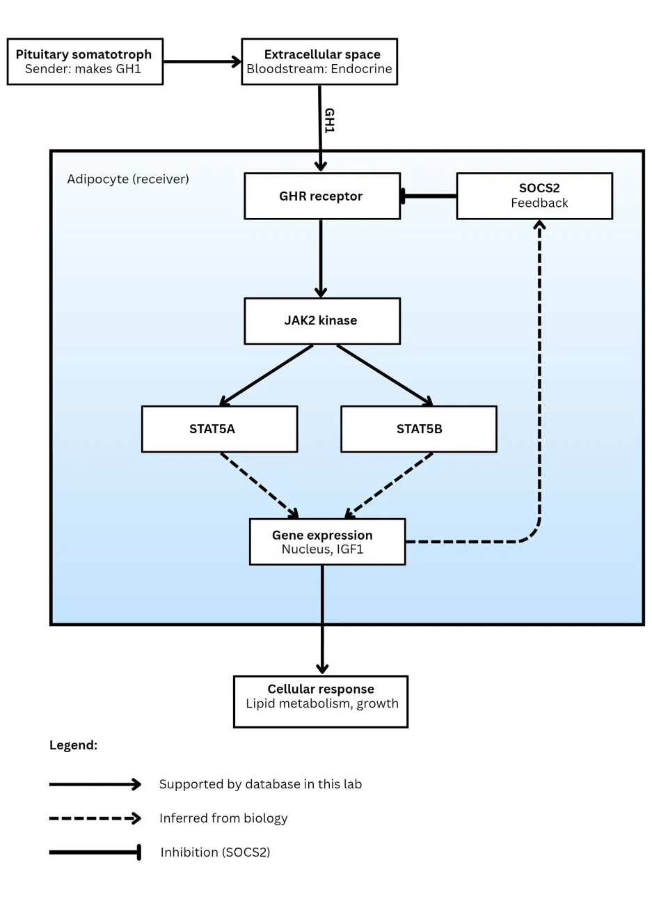

# Cell-to-Cell Communication: Pituitary Somatotroph → GH1 → GHR → Adipocyte

**Author:** Rhealyn F. Alama
**Sender cell:** Pituitary somatotroph (Homo sapiens)

## 1. Title and biological question

**How does a pituitary somatotroph communicate with a distant target cell, and what intracellular network links the extracellular signal to a cellular response?**

I reconstructed one evidence-based path from sender cell to cellular response, using the Human Protein Atlas (HPA), OmniPath, STRING and IntAct. Database results are kept separate from my own biological inference throughout.

## 2. Chosen sender cell and biological context

- **Sender cell:** Pituitary somatotroph (anterior pituitary, human)
- **Biological context:** Regulation of growth and metabolism. Somatotrophs are the endocrine cells of the anterior pituitary that secrete growth hormone into the circulation.

## 3. Candidate ligand and evidence for sender-cell expression

- **Ligand:** GH1 (growth hormone 1, somatotropin; UniProt P01241)

| Evidence (HPA) | Result |
|---|---|
| Single cell type specificity | Cell type enriched (Somatotrophs) |
| Single cell type expression cluster | Pituitary endocrine cells, neuroendocrine signaling |
| Tau specificity score (single cell) | 1.00 |
| Tissue specificity (RNA) | Tissue enriched (pituitary gland), tau 0.87 |
| Protein evidence | Evidence at protein level; cytoplasmic expression in cells of the anterior pituitary gland and placenta |
| Predicted location | Secreted, intracellular (extracellular location: predicted to be secreted) |

**Caveat:** HPA's immunohistochemistry reliability note states that the antibody (HPA043715) targets protein from more than one gene, so staining may also reflect related genes of the GH/PRL family. RNA single-cell evidence is the stronger support here.

**Signaling type:** Endocrine. GH1 is secreted into the bloodstream and acts on distant target cells.

## 4. Receptor and receiver cell with supporting evidence

- **Receptor:** GHR (growth hormone receptor; UniProt P10912)
- **Receiver cell:** Adipocyte

| Evidence (HPA, GHR) | Result |
|---|---|
| Single cell type expression cluster | Adipocytes, lipid metabolism (mainly) |
| Single cell type specificity | Group enriched (adipocytes, myocytes/myonuclei) |
| Tau specificity score | 0.66 (broadly expressed, not exclusive to adipocytes) |
| Protein evidence | Evidence at protein level |
| Predicted location | Secreted, membrane |
| Protein class | FDA approved drug targets; disease related genes |

**Why adipocyte:** I first considered hepatocytes (the classic GH target for IGF1 production), but HPA's top single-cell result for GHR was adipocytes, so I followed the evidence. GH is also known to stimulate lipolysis in fat cells, which matches the "lipid metabolism" cluster. Because GHR is broadly expressed (tau 0.66), the adipocyte is a reasonable receiver cell, not the only one.

**Checkpoint sentence:** The pituitary somatotroph produces GH1, which can signal through GHR on adipocytes in the context of growth and lipid metabolism regulation.

## 5. OmniPath findings

OmniPath is not cell-type specific, so it was used for ligand-receptor annotation and interaction information only. Receiver-cell support comes from HPA (Section 4).

- **Annotations (SignaLink_function):** GH1 = **Ligand**; GHR = **Receptor**. HGNC main class: GH1 is in the growth hormone family; GHR is fibronectin type III domain containing.
- **Interactions:**
  - GH1 → GHR (stimulation): 41 references; sources include BioGRID, CellCall, CellChatDB and 33 more.
  - GHR → JAK2 (stimulation): 15 references; JAK2 → GHR: 11 references.
  - SOCS2 ⊣ GHR (inhibition): 12 references, a negative feedback link.
  - GH1 → PRLR: 18 references, so PRLR is an alternative receptor. I chose GHR as the canonical GH receptor.
  - Upstream regulators of GH1 also appeared (e.g., POU1F1 → GH1, 98 references; STAT5A → GH1, 16; STAT5B → GH1, 12).
- **Intercell tab:** GHR rows carry locational annotations (transmembrane, secreted).

## 6. STRING network interpretation

- **Query:** GHR, GH1, JAK2, STAT5A, STAT5B, IGF1, SOCS2 (*Homo sapiens*, STRING v12.5)
- **Network statistics:** 7 nodes, 21 edges (expected: 1), average node degree 6, average local clustering coefficient 1, PPI enrichment p-value < 1.0e-16.

**Enriched terms (Gene Ontology):**

| Term | Description | Count | FDR |
|---|---|---|---|
| GO:0060396 | Growth hormone receptor signaling pathway | 7 of 21 | 6.37e-17 |
| GO:0007259 | Cell surface receptor signaling pathway via JAK-STAT | 6 of 59 | 1.75e-11 |
| GO:0060397 | Growth hormone receptor signaling pathway via JAK-STAT | 4 of 11 | 1.04e-08 |
| GO:0005131 | Growth hormone receptor binding (MF) | 3 of 10 | 2.81e-05 |

**Proteins linking receptor activation to the response:**
- **JAK2:** kinase associated with GHR (OmniPath GHR → JAK2)
- **STAT5A / STAT5B:** transcription factors in the JAK-STAT pathway
- **IGF1:** downstream growth-related effector
- **SOCS2:** negative feedback regulator (OmniPath SOCS2 ⊣ GHR)

**Interpretation limits:** A STRING edge is a functional association, not necessarily direct binding or pathway direction. Because I selected these seven proteins myself from known GH biology, the fully connected network and strong enrichment are partly expected and are not an independent discovery.

## 7. IntAct validation

- **Pair examined:** GH1 (P01241) and GHR (P10912), *Homo sapiens*, host: in vitro
- **Result:** 4 curated records, all annotated as **direct interaction**, MI score 0.73

| Interaction AC | Detection method | PubMed ID |
|---|---|---|
| EBI-21943371 | Fluorescence spectroscopy | 31279174 |
| EBI-1026633 | X-ray diffraction | 9353194 |
| EBI-1026225 | X-ray diffraction | 8943276 |
| EBI-1026236 | X-ray diffraction | 8943276 |

**Conclusion:** The evidence supports a direct physical interaction between GH1 and GHR. It comes from structural and biophysical studies of purified proteins in vitro, so it shows that the proteins can bind directly, not that this occurs in somatotroph-to-adipocyte signaling in vivo. Rows 3 and 4 come from the same publication (A-B and B-A orientation), so the records are not four independent experiments.

**GHR-JAK2:** The IntAct search for GHR (P10912) did not show JAK2 among its interactors. This means **no IntAct record was found**, not that no interaction exists. OmniPath (15 references) and STRING both support the link, so the databases disagree. I consider the OmniPath and STRING evidence reasonable support, but it is weaker than the structural evidence for GH1-GHR.

## 8. Final model and interpretation

**Interpretation (about 215 words):**
The pituitary somatotroph produces growth hormone (GH1), which enters the bloodstream and acts as an endocrine signal. HPA shows GH1 is cell type enriched in somatotrophs (tau 1.00), with protein-level evidence and a predicted secreted location. OmniPath annotates GH1 as a ligand and GHR as a receptor, with a GH1 → GHR interaction supported by 41 references. IntAct lists four GH1-GHR records annotated as direct interaction (X-ray diffraction and fluorescence spectroscopy, MI score 0.73), supporting physical binding in vitro. HPA shows GHR is group enriched in adipocytes and myocytes, so I chose the adipocyte as the receiver cell, although GHR is broadly expressed (tau 0.66). In STRING, GHR, GH1, JAK2, STAT5A, STAT5B, IGF1 and SOCS2 formed a fully connected network (21 edges, PPI enrichment p < 1e-16) enriched for growth hormone receptor signaling via JAK-STAT (FDR 1.04e-08). Strongly supported: GH1 production by somatotrophs, GH1-GHR binding, and the JAK-STAT association. Inferred: that this pathway operates in adipocytes, that STAT5 drives IGF1 and lipid-metabolism changes there, and that SOCS2 is induced as feedback. IntAct returned no GHR-JAK2 record, which means no record was found, not that no interaction exists. Because I chose the proteins myself, the network's high connectivity is partly expected.

## 9. Answers to laboratory questions

1. **Sender cell and context:** Pituitary somatotroph, acting in the anterior pituitary in the context of growth and metabolism regulation.
2. **Signaling molecule and evidence:** GH1 (growth hormone). HPA shows single-cell enrichment in somatotrophs (tau 1.00), protein-level evidence, and a predicted secreted location.
3. **Receptor and receiver cell:** GHR on adipocytes (adipocyte-enriched in HPA single-cell data).
4. **Type of signaling:** Endocrine. GH1 is secreted into the bloodstream and acts on distant cells.
5. **Most relevant STRING proteins:** JAK2 (kinase associated with GHR), STAT5A and STAT5B (transcription factors carrying the signal to the nucleus), IGF1 (downstream growth effector) and SOCS2 (negative feedback on GHR).
6. **Enriched process:** Growth hormone receptor signaling pathway (GO:0060396, FDR 6.37e-17) and growth hormone receptor signaling via JAK-STAT (GO:0060397, FDR 1.04e-08), consistent with the proposed mechanism.
7. **IntAct result:** Four GH1-GHR records, all annotated as direct interaction, supported by X-ray diffraction (PMIDs 9353194, 8943276) and fluorescence spectroscopy (PMID 31279174), in vitro, MI score 0.73.
8. **Strongly supported vs. inferred:** *Strongly supported:* GH1 production by somatotrophs (HPA), GH1 as ligand and GHR as receptor (OmniPath), direct GH1-GHR binding (IntAct), and the JAK-STAT association (STRING/GO). *Inferred:* that adipocytes receive the signal in vivo from somatotrophs, that JAK2/STAT5 relays it in adipocytes, that STAT5 drives IGF1 and lipid-metabolism changes, and that SOCS2 is induced as feedback. GHR-JAK2 had no IntAct record.
9. **Expected response in the receiver cell:** Changes in lipid metabolism and growth-related gene expression. GH binding to GHR activates JAK2 and STAT5, which regulate gene transcription (including IGF1), and GH is known to stimulate lipolysis in adipocytes. SOCS2 provides negative feedback that limits the signal.

## 10. References and database links

- Human Protein Atlas, GH1: https://www.proteinatlas.org/ENSG00000259384-GH1/single+cell
- Human Protein Atlas, GH1 tissue: https://www.proteinatlas.org/ENSG00000259384-GH1/tissue
- Human Protein Atlas, GHR: https://www.proteinatlas.org/ENSG00000112964-GHR/single+cell
- OmniPath Explorer: https://explore.omnipathdb.org/
- STRING (v12.5): https://string-db.org/
- IntAct: https://www.ebi.ac.uk/intact/
- UniProt GH1 (P01241): https://www.uniprot.org/uniprotkb/P01241
- UniProt GHR (P10912): https://www.uniprot.org/uniprotkb/P10912
- IntAct source publications: PubMed 31279174, 9353194, 8943276 (https://pubmed.ncbi.nlm.nih.gov/)
